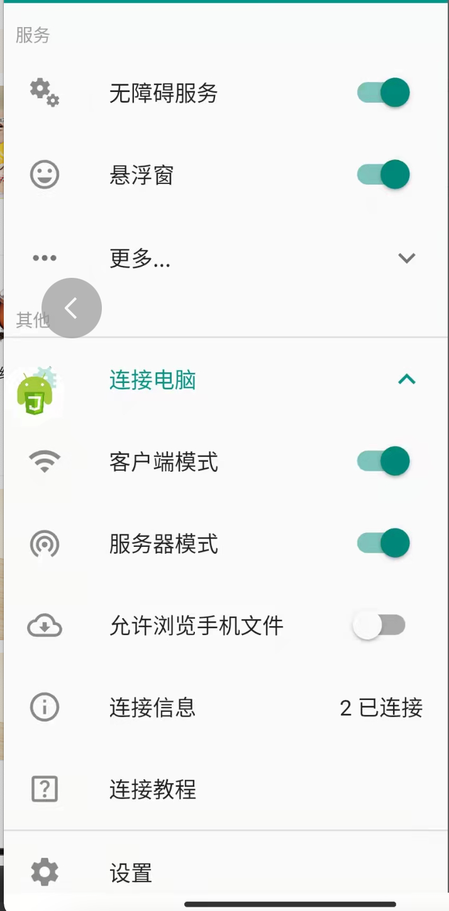

本项目纯属学习~不要违规违法造成法律责任概不负责。
仅支持安卓手机。

## 使用

1. 推荐使用 vscode 编辑器
2. 安装 vscode 插件 Auto.js-Pro-Ext
3. 安装项目依赖
   `npm 版本 8.1.0`
   `npm install`
4. 手机上安装 [autojs app](https://autojspro-apk-1252460104.cos.ap-guangzhou.myqcloud.com/autojspro8.0-latest.apk)
5. 打开 autojs app，打开无障碍服务、链接电脑：客户端模式和服务器模式都打开（手机和电脑连接相同的 wifi）
   
6. vscode 连接到新设备
7. vscode 选择刚刚连接的设备进行调试
   

> 如果还有不懂的也可以加我微信，at-529，加好友时请备注：robFood
> 如果对你有帮助请给个 **star** 支持，谢谢~~